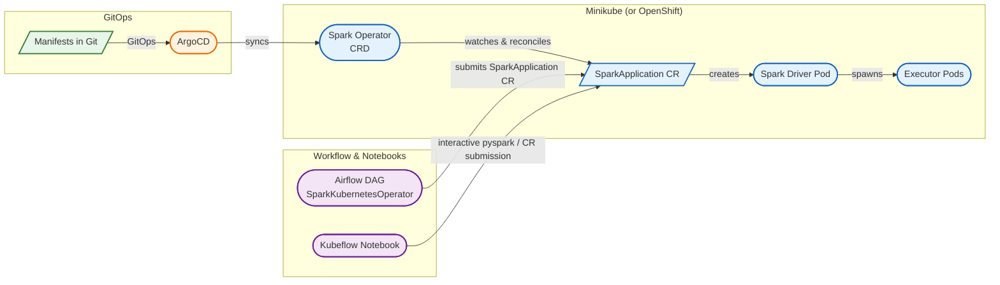
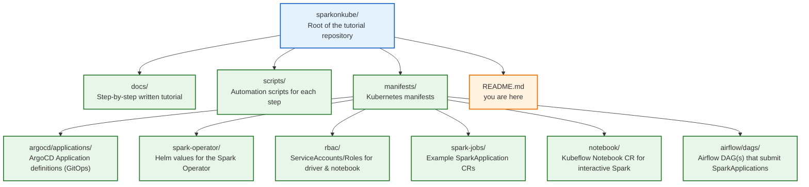

# Spark on OpenShift/Kubernetes — Step-by-Step Tutorial

A hands-on, script-driven tutorial that takes you from zero to running **Apache Spark**
jobs on a local Kubernetes cluster (Minikube — a stand-in for OpenShift) using the
**Kubeflow Spark Operator**, deployed and managed via **ArgoCD (GitOps)**, orchestrated
by an external workflow scheduler (**Apache Airflow**, with a note on **dbt**), and
run interactively from a **Kubeflow Notebook**.

Everything here also applies to a real **OpenShift** cluster with minor command
substitutions (`kubectl` → `oc`), called out in [`docs/09-openshift-notes.md`](docs/09-openshift-notes.md).

## What you will build



## Prerequisites

- macOS or Linux workstation, 8GB+ free RAM, 4+ CPU cores
- Docker (or another container runtime) installed and running
- `kubectl`, `helm`, `minikube` (installation covered in step 0)

## Tutorial Roadmap

Follow the docs **in order**. Each step has copy-pasteable scripts in [`scripts/`](scripts)
and Kubernetes manifests in [`manifests/`](manifests).

| Step | Doc | What you'll do |
|------|-----|-----------------|
| 0 | [`docs/00-prerequisites.md`](docs/00-prerequisites.md) | Install CLI tools |
| 1 | [`docs/01-minikube-setup.md`](docs/01-minikube-setup.md) | Bring up a local Kubernetes cluster |
| 2 | [`docs/02-spark-operator-setup.md`](docs/02-spark-operator-setup.md) | Install the Kubeflow Spark Operator via Helm |
| 3 | [`docs/03-argocd-setup.md`](docs/03-argocd-setup.md) | Install ArgoCD and manage the Spark Operator via GitOps |
| 4 | [`docs/04-spark-architecture.md`](docs/04-spark-architecture.md) | Understand how Spark driver/executor pods work on Kubernetes |
| 5 | [`docs/05-running-spark-jobs.md`](docs/05-running-spark-jobs.md) | Submit your first `SparkApplication` (`spark-submit` under the hood) |
| 6 | [`docs/06-kubeflow-notebook-spark.md`](docs/06-kubeflow-notebook-spark.md) | Run Spark interactively from a Kubeflow/Jupyter Notebook |
| 7 | [`docs/07-airflow-orchestration.md`](docs/07-airflow-orchestration.md) | Orchestrate Spark jobs on a schedule with Apache Airflow |
| 8 | [`docs/08-dbt-spark-integration.md`](docs/08-dbt-spark-integration.md) | Run dbt transformations on Spark, triggered from Airflow |
| 9 | [`docs/09-openshift-notes.md`](docs/09-openshift-notes.md) | Differences when deploying to real OpenShift |
| 10 | [`docs/10-troubleshooting.md`](docs/10-troubleshooting.md) | Common errors and fixes |

## Repository Layout



## Quick Start (TL;DR)

```bash
./scripts/00-install-cli-tools.sh      # install kubectl/helm/minikube (macOS via brew)
./scripts/01-start-minikube.sh         # start local cluster
./scripts/02-install-spark-operator.sh # install Spark Operator via Helm
./scripts/03-install-argocd.sh         # install ArgoCD
./scripts/04-install-kubeflow-notebook.sh  # optional: interactive notebook
./scripts/05-install-airflow.sh        # optional: workflow scheduler
kubectl apply -f manifests/rbac/spark-rbac.yaml
kubectl apply -f manifests/spark-jobs/spark-pi.yaml
kubectl get sparkapplications
```

Then dive into the docs starting at [`docs/00-prerequisites.md`](docs/00-prerequisites.md)
for the full step-by-step explanation of *why* each step matters, not just *how*.
